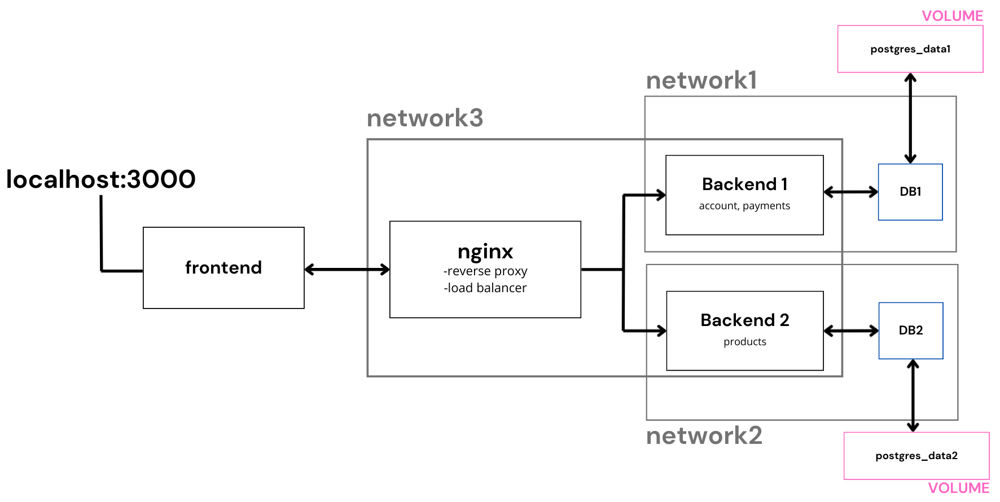

# E-commerce Platform

A full-stack e-commerce platform built with Django and React, featuring secure payment processing, user authentication, and a modern shopping experience. This project was realized as an exercise to to test the knowledge regarding microservices, CI/CD, data persistance (through docker volumes), hot reloading and load balancing. The following is a schema describing the project's architecture:



## Project Overview

This e-commerce platform consists of two main components:

### Backend (Django)
- RESTful API built with Django REST Framework
- Secure user authentication with JWT
- PostgreSQL database for data persistence
- Stripe integration for payment processing
- Modular architecture with separate apps for products, payments, and user accounts

### Frontend (React)
- Modern, responsive UI built with React
- Redux for state management
- Secure payment integration with Stripe
- Real-time updates with hot reloading
- User-friendly shopping experience

## Prerequisites
- Docker and Docker Compose
- Node.js (for local frontend development)
- Python 3.11 (for local backend development)

## Quick Start

1. Clone the repository:
```bash
git clone <repository-url>
cd <repository-name>
```

2. Start the application using Docker:
```bash
docker-compose up --build
```

The application will be available at:
- Frontend: http://localhost:3000

## Development Setup

### Backend Development
1. Navigate to the backend directory:
```bash
cd backend
```

2. Create and activate a virtual environment:
```bash
python -m venv venv
source venv/bin/activate  # On Windows: venv\Scripts\activate
```

3. Install dependencies:
```bash
pip install -r requirements.txt
```

4. Run migrations:
```bash
python manage.py migrate
```

5. Start the development server:
```bash
python manage.py runserver
```

### Frontend Development
1. Navigate to the frontend directory:
```bash
cd frontend
```

2. Install dependencies:
```bash
npm install
```

3. Start the development server:
```bash
npm start
```

## Features
- User authentication and authorization
- Product catalog with categories
- Shopping cart functionality
- Secure payment processing with Stripe
- Order management
- Admin dashboard
- Responsive design
- Real-time updates
- Data persistence
- Containerized deployment

## Installation
after downloading/cloning the repository code follow below steps:
* (NOTE: your need to mention your own stripe secret api key and publishable key in django to run the project)

### Backend
* (for both linux and windows)
1) Move in backend folder through terminal and run following commands,

`python3 -m venv env` (for windows --> `python -m venv env`) 

`source env/bin/activate` (for windows --> `env\scripts\activate`)

`pip install -r requirements.txt` (same for both)

`python manage.py runserver` (same for both)

### Frontend
* (for both linux and windows)
2) Move in frontend folder through terminal and run follwing commands

`npm i`

`npm start`

## Docker Setup

To run the application using Docker:

1. Make sure Docker and Docker Compose are installed on your system
2. Navigate to the project root directory
3. Run the following command to build and start all containers:
```bash
docker-compose up --build
```

This will:
- Build and start the frontend container (accessible at http://localhost:3000)
  - Includes hot reloading support - changes to frontend code will automatically update in the browser
- Build and start the backend container (accessible at http://localhost:8000)
- Start the PostgreSQL database container
- Set up the necessary networks between containers
- Create and mount persistent volumes for data storage

To stop the containers:
```bash
docker-compose down
```

Note: The first build might take a few minutes as it needs to download and build all dependencies.

### Development Features
- **Hot Reloading**: The frontend container is configured with hot reloading enabled. Any changes you make to the React code will be immediately reflected in the browser without needing to rebuild or restart the container.
- **Volume Mounting**: The frontend source code is mounted as a volume, ensuring that your local changes are immediately synced with the container.
- **Development Mode**: The frontend runs in development mode with all React development tools and features available.

### Persistent Data Storage
The application uses Docker volumes to ensure data persistence across container restarts:

**Frontend Volumes:**
- `frontend_build`: Persists the built React application

**Backend Volumes:**
- `backend_data`: Stores application data
- `backend_media`: Stores user-uploaded media files
- `backend_static`: Stores static files

**Database Volumes:**
- `postgres_data`: Stores PostgreSQL database files
- `postgres_backup`: Stores database backups

These volumes ensure that:
- All data persists even if containers are stopped or removed
- Each service has its own isolated storage
- User uploads and media files are preserved
- Database data and backups are maintained

## CI/CD Pipeline

This project includes a comprehensive CI/CD pipeline using GitHub Actions. The pipeline includes:

### Security Checks
- Static Application Security Testing (SAST) for Dockerfiles using Hadolint
- Vulnerability scanning using Trivy
- Security best practices enforcement during builds

### Automated Testing
- Backend tests using Django's test framework
- Frontend tests using React Testing Library
- All tests must pass before deployment

### Continuous Deployment
- Automatic building of Docker images
- Push to Docker Hub on successful builds
- Deployment to production environment (when configured)

### Setting up Docker Hub Integration
1. Create a Docker Hub account if you don't have one
2. In your GitHub repository settings, add these secrets:
   - `DOCKERHUB_USERNAME`: Your Docker Hub username
   - `DOCKERHUB_TOKEN`: Your Docker Hub access token

The pipeline runs on:
- Every push to main and develop branches
- Every pull request to these branches

Images are pushed to Docker Hub only on successful merges to the main branch.

## All set ! Happy coding :)

<p><a href="#top">Back to Top</a></p>

